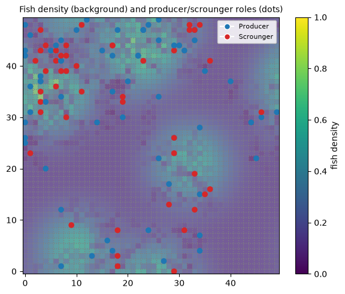

# Group 14 — Agent-Based Fishing Model

## How to Run

Run the dashboard (live preview + metrics):
```
uv run solara run app.py
```


To collect results, open and run `understanding.ipynb`.

## Project Structure

The main folder contains the core codebase. Subfolders build on these files with performance improvements or different parameter sweeps.

### `finlay/`
Contains the final code used for sensitivity analysis.